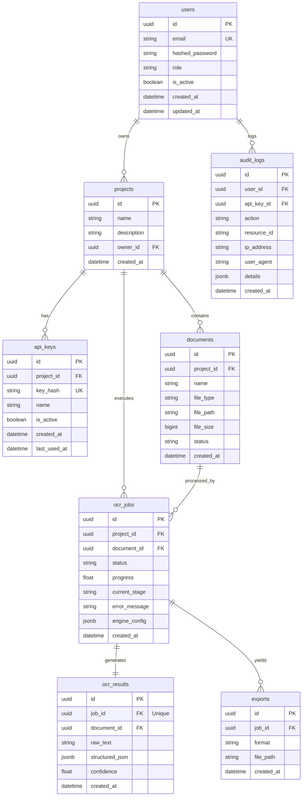

# Enterprise OCR Engine

A production-ready, highly modular, scalable standalone OCR-as-a-Service engine built using **Clean Architecture**, **Domain-Driven Design (DDD)**, and **SOLID** principles.

The engine processes document uploads asynchronously using a pluggable AI pipeline (PDF conversion, OpenCV image preprocessing, layout detection via NVIDIA LocateAnything, text recognition, entity extraction, form detection, and structured exports).

---

## 1. System Architecture

We employ a strict Clean Architecture model where the core domain logic has zero dependencies on frameworks, databases, or third-party AI libraries. Frameworks and libraries are instead injected via repository and service interfaces.

```mermaid
graph TD
    subgraph Presentation Layer (FastAPI Routers)
        API[FastAPI Routers / Schemas]
        DI[Dependency Injection]
    end

    subgraph Application Layer (Core Use Cases)
        UC[Use Cases]
        Ports[Interfaces: Storage, Queue, AI]
    end

    subgraph Domain Layer (Entities & Value Objects)
        DE[Entities: User, Project, Job, Result]
        VO[Value Objects: BoundingBox, Email]
    end

    subgraph Infrastructure Layer (Adapters)
        DB[PostgreSQL / SQLAlchemy]
        Redis[Redis Queue / Celery Tasks]
        Storage[S3 / Local Storage]
        CV2[OpenCV Preprocessor]
        AI[Pluggable OCR: EasyOCR/PaddleOCR/TrOCR]
    end

    API --> UC
    DI --> UC
    UC --> DE
    UC --> VO
    DB -.-> Ports
    Redis -.-> Ports
    Storage -.-> Ports
    AI -.-> Ports
    CV2 -.-> Ports
```

---

## 2. Pluggable OCR Pipeline Workflow

```mermaid
graph LR
    Upload[Upload] --> PDF[PDF Converter]
    PDF --> Prep[Image Preprocessing]
    Prep --> Detect[LocateAnything Detection]
    Detect --> Rec[OCR Recognition]
    Rec --> Layout[Layout Analysis]
    Layout --> Order[Reading Order]
    Order --> Tables[Table Detection]
    Tables --> Forms[Form Detection]
    Forms --> Entities[Entity Extraction]
    Entities --> Post[Post Processing]
    Post --> Export[Export Generation]
```



---

## 3. Database Schema

The PostgreSQL schema isolates data by project tenants.プログラム API Keys allow secure server-to-server calls.



---

## 4. API Endpoints Contract (v1)

### Authentication
* `POST /api/v1/auth/register` - Create developer account.
* `POST /api/v1/auth/token` - Authenticate using password and retrieve JWT access token.

### Projects & API Keys
* `POST /api/v1/projects` - Create a project tenant.
* `GET /api/v1/projects` - List all projects.
* `POST /api/v1/projects/{project_id}/api-keys` - Generate a secure `x-api-key` header key.

### Document Uploads
* `POST /api/v1/documents` - Standard multipart upload.
* `POST /api/v1/documents/batch` - Batch upload multiple files simultaneously.
* `POST /api/v1/documents/chunk/init` - Initialize resumable chunked upload session.
* `POST /api/v1/documents/chunk/upload` - Upload file parts. Merges on last chunk automatically.

### OCR Job & Results
* `POST /api/v1/jobs` - Submit a document to queue for async processing.
* `GET /api/v1/jobs/{job_id}` - Query status progress (`0.0` - `1.0`) and stage execution.
* `GET /api/v1/results/{job_id}` - Retrieve structured JSON results.
* `GET /api/v1/results/download/{job_id}/export?format={format}` - Download exports (`JSON`, `TXT`, `MD`, `CSV`, `XML`, `DOCX`, `PDF`).

---

## 5. Deployment Guide & Docker Compose

For production deployments, the system is fully containerized with a fronting NGINX reverse-proxy load balancer.

### Run Local Orchestration Stack

1. **Clone the repository and set environment variables:**
   Create a `.env` file in the root directory:
   ```env
   ENV=production
   DEBUG=false
   POSTGRES_USER=postgres
   POSTGRES_PASSWORD=postgres
   POSTGRES_HOST=db
   POSTGRES_DB=ocr_db
   REDIS_HOST=redis
   JWT_SECRET_KEY=yoursecretsecuritykeyoverride
   STORAGE_PROVIDER=local
   OCR_RECOGNITION_ENGINE=easyocr
   ```

2. **Start Docker Compose Containers:**
   ```bash
   docker compose up --build -d
   ```
   This initializes:
   * PostgreSQL (`db` port 5432)
   * Redis (`redis` port 6379)
   * API Server (`api` port 8000 internally)
   * Celery worker (`worker`)
   * NGINX Reverse Proxy (`nginx` port 80 externally)

3. **Verify API Docs:**
   Access the Swagger API documentation on [http://localhost/docs](http://localhost/docs).

---

## 6. Verification and Testing

### Run Tests locally

1. **Install requirements:**
   ```bash
   pip install -r requirements.txt
   ```

2. **Run Pytest:**
   ```bash
   pytest
   ```
   This executes OpenCV preprocessor unit tests and isolated HTTP integration test cases using an in-memory SQLite override.
